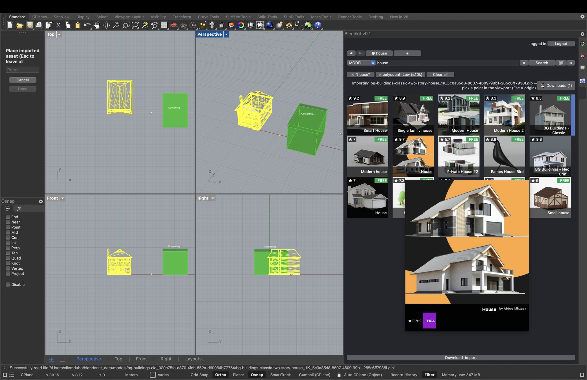

# Blendkit for Rhino 8

[Blendkit](https://www.blendkit.com/) (formerly BlenderKit) brings thousands of
free and paid 3D models, materials, and HDR environments straight into Rhino 8.
Search the library in a dockable panel, then drag and drop assets into your
scene.



**What you can do:**

- Search thousands of assets, with filters, categories, ratings, and bookmarks.
- Drag a model from the panel and drop it in the viewport — it downloads,
  converts, and lands exactly where you dropped it.
- Drop the same asset again and it places instantly as a shared block instance.
- Import materials as native Rhino PBR materials, and HDRs as viewport
  environments.
- Log in with your blendkit.com account for the full asset library.

**Not supported in Rhino (yet):** uploading assets — use the
[Blender add-on](https://github.com/BlenderKit/blenderkit) for that. Comments
and notifications open on blendkit.com in your browser.

## Install

Blendkit is on the Rhino **Package Manager**, so there is nothing to build:

1. In Rhino 8, run the `PackageManager` command (or open **Tools ▸ Package
   Manager**).
2. Search for **Blendkit** (the old name **BlenderKit** finds it too) and click
   **Install**.
3. Restart Rhino.
4. Run the `Blendkit` command, or open **Panels ▸ Blendkit**, to show the panel.
5. Click **Login** in the panel — a browser window opens so you can authorize
   your blendkit.com account.

Works on Windows and macOS, Apple Silicon included.

**Good to know:** many assets are delivered as Blender files and converted to
glTF on your machine the first time you use them. For that you need
[Blender](https://www.blender.org/download/) installed — the plug-in will point
you to the download if it can't find it. Conversion usually takes a few seconds
per asset and only happens once; after that the asset is cached locally.

## Status

Blendkit for Rhino is **alpha** software. It already covers most of what the
Blender add-on does: search and filters, categories, login, ratings, bookmarks,
models, materials and HDRIs, drag-drop placement with a live preview box, and
shared block instances for repeated drops. Uploading is the main intentional
gap.

### Known issues

Rendering is the least-finished area — treat imported assets as a preview, not
a final result:

- **Materials are approximate.** Assets are authored for Blender's
  Cycles/EEVEE renderers and converted to Rhino PBR materials on import. Base
  color, roughness, metalness, and normal maps usually survive the trip;
  procedural (shader-node) materials, displacement, and complex texture blends
  do not. Expect to polish materials before a final render.
- **The first Raytraced view is slow.** The first time you switch a viewport
  to Raytraced after importing, Rhino's Cycles compiles shaders and uploads
  textures before the image starts refining. Later switches are much faster.
- **The occasional asset converts incompletely.** Some `.blend` files don't
  survive the glTF conversion cleanly and import with missing parts.
- **If a download ever gets stuck,** it clears itself after a couple of
  minutes. You can also cancel it earlier — click the ✕ on its preview box in
  the viewport, or use the Downloads popup in the panel.

Found a bug? Please report it at
<https://github.com/BlenderKit/blendkit-rhino/issues> — reports genuinely help
at this stage.

---

## Building from source (developers)

Everything below is for working on the plug-in itself. End users only need the
**Install** section above.

### Repo layout

```
.
├── src/                   # C# plugin shell (.rhp) — namespace Blendkit.Rhino,
│                          # output BlendkitRhino.rhp
├── bk_client/             # git submodule: the shared Blendkit Go client
│                          # (github.com/BlenderKit/bk_client) + Blender recipes
├── python/
│   └── blendkit_rhino/    # helper scripts (asset extraction, ScriptEditor dev shim)
├── deploy/
│   ├── deploy_rhino.bat   # Windows: build + copy artifacts into Rhino's Plug-ins folder
│   ├── deploy_rhino.sh    # macOS:   same, for Rhino 8.app
│   └── manifest*.yml      # Yak (Rhino Package Manager) metadata
├── docs/                  # README assets (screenshot)
└── tests/                 # xUnit tests (CI-runnable, no Rhino required)
```

Naming: the user-visible name and the internal identifiers (namespace
`Blendkit.Rhino`, assembly `BlendkitRhino`) are all **Blendkit**, the current
brand (formerly **BlenderKit**). The shared on-disk interop paths
(`~/blenderkit_data`, `%APPDATA%\BlenderKit\config.json`) deliberately keep the
old spelling so existing installs and the Blender add-on's shared cache keep
working.

### The Go client

The Go HTTP client is shared across all Blendkit integrations (Blender, Rhino,
and others) and lives in its own repo,
[bk_client](https://github.com/BlenderKit/bk_client), included here as a git
submodule. After cloning, fetch it with:

```
git submodule update --init
```

The deploy scripts locate the client source/binary in this order:

1. `BLENDKIT_CLIENT_DIR` environment variable (explicit override),
2. `bk_client/client/` — the submodule (macOS script; the canonical location),
3. legacy sibling-checkout paths (`../client/`,
   `../source_addon/blenderkit/client/`, …) kept for older dev setups.

On macOS, `deploy_rhino.sh` builds the client on every run (`go build`, output
`bk_client-macos-<arch>`), targeting the host architecture so an Apple Silicon
Mac always gets a native arm64 binary; pass `--noclient` to reuse the existing
binary. On Windows, `deploy_rhino.bat` expects a pre-built client — build it
once in `bk_client/client/` with `go build`, or set `BLENDKIT_CLIENT_DIR`.

Note: the client **embeds** the Blender recipe scripts (`tools/*.py`) at build
time via `go:embed`, so after editing a recipe you must rebuild the client.
(The Rhino plug-in also sends its recipe by absolute path, which overrides the
embedded copy — but rebuilding keeps the two in sync.)

### Dev workflow

1. Install Rhino 8 (Windows or macOS) and a Go toolchain.
2. `git submodule update --init` to fetch the client.
3. Run `deploy/deploy_rhino.sh` (macOS) or `deploy/deploy_rhino.bat` (Windows).
   It builds the client and the `.rhp`, then copies both into Rhino's plug-ins
   folder (e.g. `%APPDATA%\McNeel\Rhinoceros\8.0\Plug-ins\Blendkit\`). On macOS
   it also mirrors the deploy into the Yak-installed package folder if one
   exists — Rhino loads the Yak copy in preference to `Plug-ins/`, so a deploy
   that skipped it would silently run stale code. Pass `--noyak` to skip the
   mirror.
4. First install only: Rhino → **Tools ▸ Options ▸ Plug-ins ▸ Install…** and
   pick the `.rhp` (or install the `.yak` via `PackageManager`). After that,
   just re-run the deploy script and restart Rhino — Rhino cannot reload a
   plug-in without a restart.
5. macOS only: if `dotnet` is not installed, `deploy_rhino.sh` skips the `.rhp`
   build and reuses the one already on disk (e.g. built on a Windows machine).
   The client and Python helpers are still refreshed, which covers most
   day-to-day iteration.

Pure-Python helper code can be iterated inside Rhino's ScriptEditor with
`importlib.reload(module)` — no restart needed for small changes.

### Testing without a mouse

`_-BlendkitSimDrop 8 chair` runs a search and then dispatches eight simulated
drag-drops through the real pipeline (drag tracking, download, convert,
import) with a scripted mouse — useful for reproducing drag bugs headlessly.
Progress is logged to `~/blenderkit_data/client/rhino_panel.log` (look for
`[simdrop]` and `[dragtrace]` lines).

## Releasing to the Yak package server

One-shot release script (Windows):

```cmd
deploy\release.bat 0.1.2
```

It refuses to run on a dirty working tree, bumps the version in
`BlendkitRhino.csproj` and both `manifest*.yml` files, commits the bump
(`release: 0.1.2`), builds and packs the **Windows** `.yak`
(`deploy_rhino.bat`) and the **macOS** `.yak` (`pack_mac.bat`, which
cross-builds the darwin/arm64 client), pushes both to
<https://yak.rhino3d.com>, and tags `v0.1.2` in git.

Prerequisites: `yak login` run at least once (token cached at
`%APPDATA%\McNeel\yak.yml`) and Go on `PATH` for the darwin cross-compile. If
the push fails with "error retrieving your cached token", run `yak login` and
re-invoke `release.bat` with the same version — the version commit is already
in place and the build steps reproduce the same `.yak` files.

Note that `deploy_rhino.bat` closes Rhino during the deploy step so the `.rhp`
can be copied into the local plug-ins folder.

To rebuild only the macOS `.yak` between releases, run `deploy\pack_mac.bat`
directly — it produces
`build\Release\packages\blendkit-<version>-rh8_0-mac.yak` for a manual
`yak push`. The packer patches the zip's `external_attr` on the client binary
to `0o100755` so the Mach-O executable keeps its execute bit — `yak.exe` on
Windows would otherwise leave it at `0` and the client wouldn't run after
extraction on a Mac.

On macOS, `deploy_rhino.sh` packs the mac `.yak` itself by default
(`yak build --platform mac`); pass `--nopack` to skip.
